Vue is a very impressive project, and in addition to the core of the framework, it maintains a lot of utilities that make a Vue programmer's life easier.

One of them is the Vue CLI.

CLI stands for Command Line Interface.

> Note: There is a huge rework of the CLI going on right now, going from version 2 to 3. While not yet stable, I will describe version 3 because it's a huge improvement over version 2, and quite different.

## Installation

The Vue CLI is a command line utility, and you install it globally using npm:

```bash
npm install -g @vue/cli
```

or using Yarn:

```bash
yarn global add @vue/cli
```

Once you do so, you can invoke the `vue` command.


## What does the Vue CLI provide?

The CLI is essential for rapid Vue.js development.

Its main goal is to make sure all the tools you need are working along, to perform what you need, and abstracts away all the nitty-gritty configuration details that using each tool in isolation would require.

It can perform an initial project setup and scaffolding.

It's a flexible tool: once you create a project with the CLI, you can go and tweak the configuration, without having to *eject* your application (like you'd do with `create-react-app`).

> When you eject from create-react-app you can update and tweak what you want, but you can't rely on the cool features that create-react-app provides

You can configure anything and still be able to upgrade with ease.

After you create and configure the app, it acts as a runtime dependency tool, built on top of webpack.

The first encounter with the CLI is when creating a new Vue project.

## How to use the CLI to create a new Vue project

The first thing you're going to do with the CLI is to create a Vue app:

```bash
vue create example
```

The cool thing is that it's an interactive process. You need to pick a preset. By default, there is one preset that's providing Babel and ESLint integration:

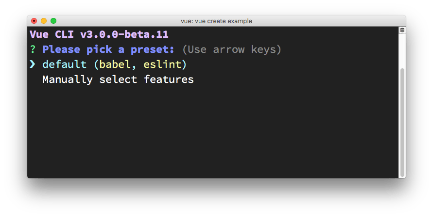

I'm going to press the down arrow ⬇️  and manually choose the features I want:


Press `space` to enable one of the things you need, and then press `enter` to go on. Since I chose a linter/formatter, Vue CLI prompts me for the configuration. I chose ESLint + Prettier since that's my favorite setup:

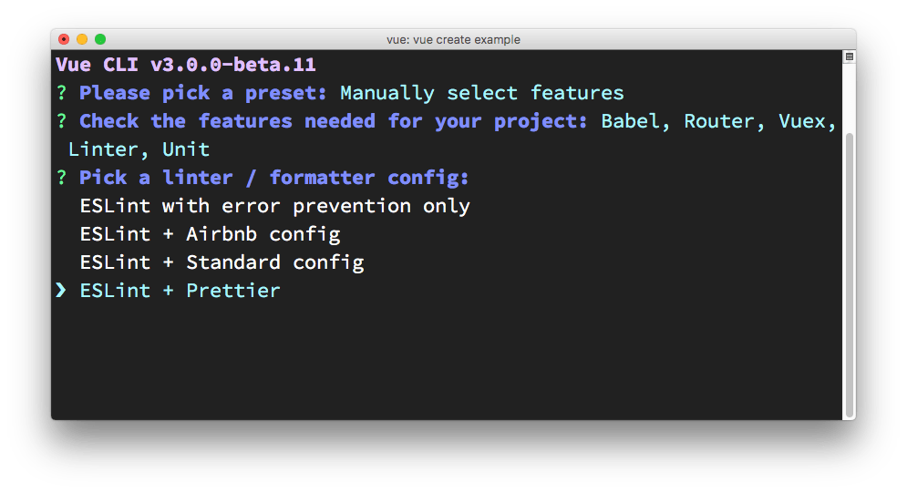

Next thing is choosing how to apply linting. I choose **lint on save**.

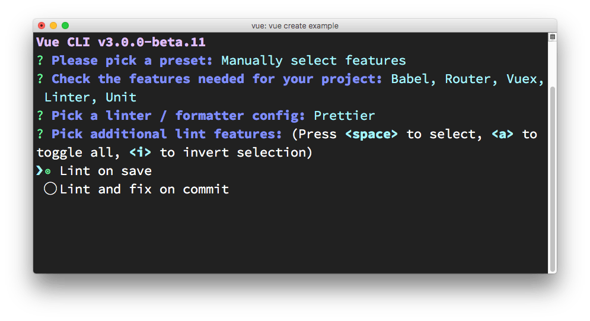

Next up: testing. I picked testing, and Vue CLI offers me to choose between the two most popular solutions: Mocha + Chai vs Jest.

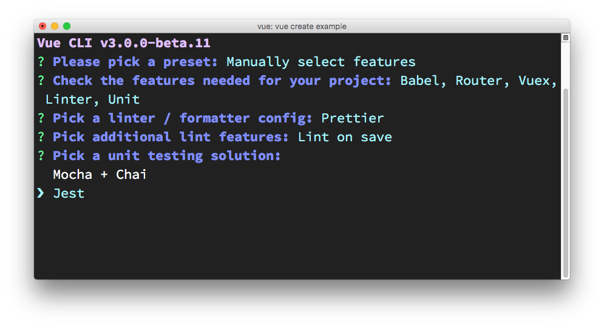

Vue CLI asks me where to put all the configuration: if in the `package.json` file, or in dedicated configuration files, one for each tool. I chose the latter.


Next, Vue CLI asks me if I want to save these presets, and allow me to pick them as a choice the next time I use Vue CLI to create a new app. It's a very convenient feature, as having a quick setup with all my preferences is a complexity reliever:

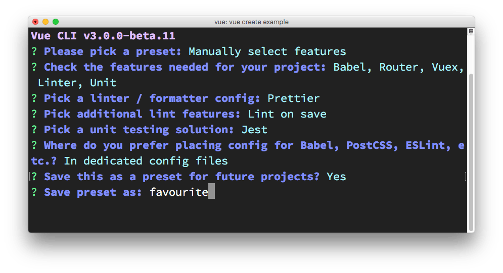

Vue CLI then asks me if I prefer using Yarn or npm:


and it's the last thing it asks me, and then it goes on to download the dependencies and create the Vue app:

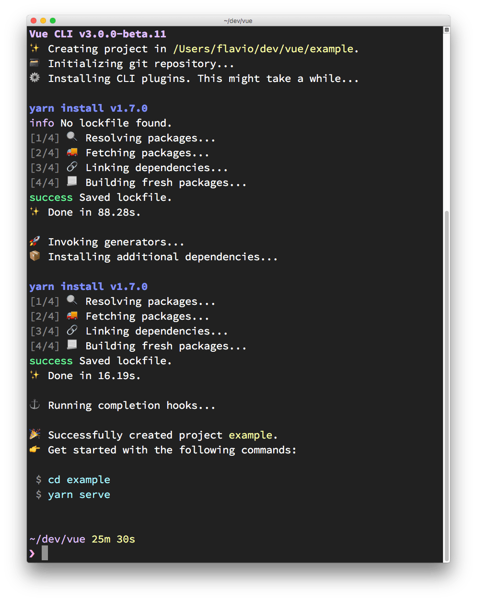

## How to start the newly created Vue CLI application

Vue CLI has created the app for us, and we can go in the `example` folder and run `yarn serve` to start up our first app in development mode:

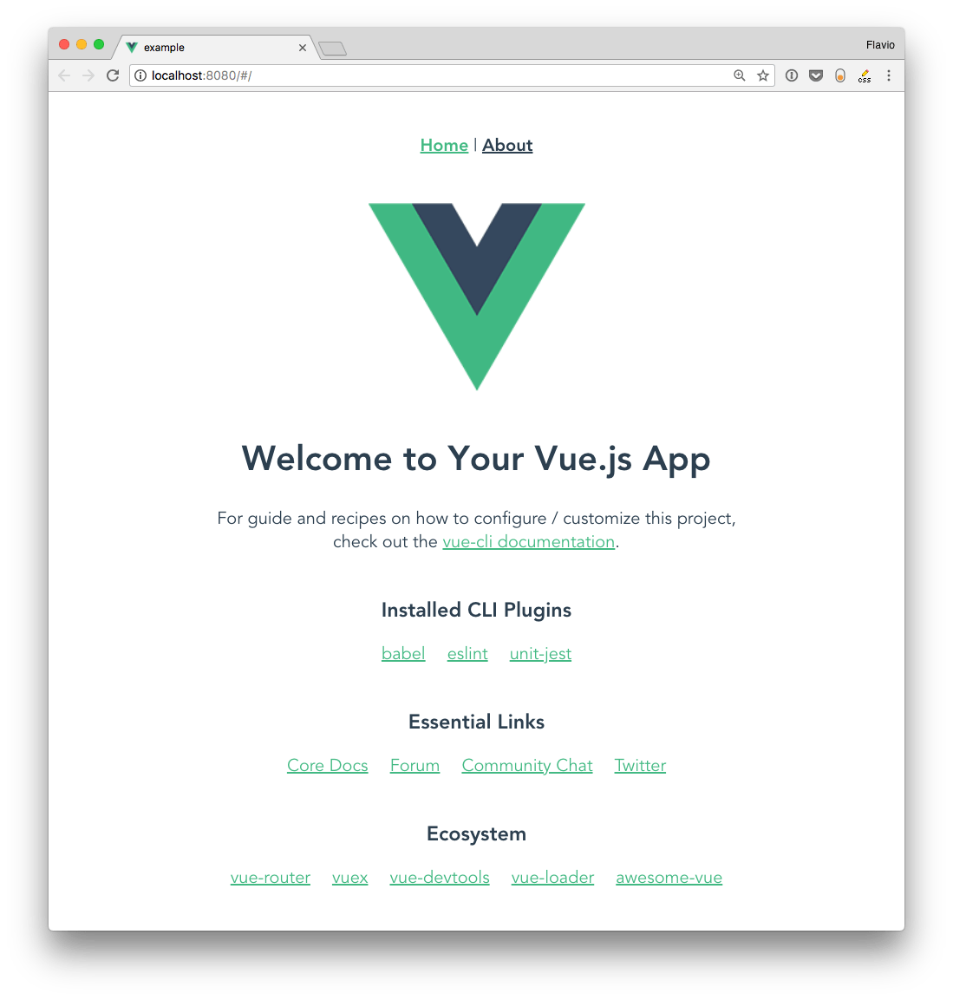

The starter example application source contains a few files, including `package.json`:

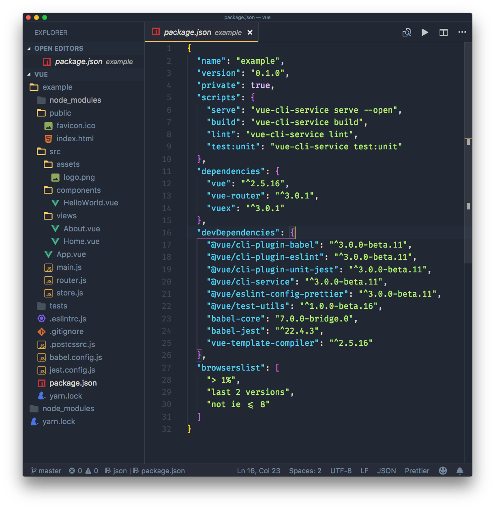

This is where all the CLI commands are defined, including `yarn serve`, which we used a minute ago. The other commands are

- `yarn build`, to start a production build
- `yarn lint`, to run the linter
- `yarn test:unit`, to run the unit tests

I will describe the sample application generated by Vue CLI in a separate tutorial.

## Git repository

Notice the `master` word in the lower-left corner of VS Code? That's because Vue CLI automatically creates a repository, and makes the first commit, so we can jump right in, change things, and we know what we changed:

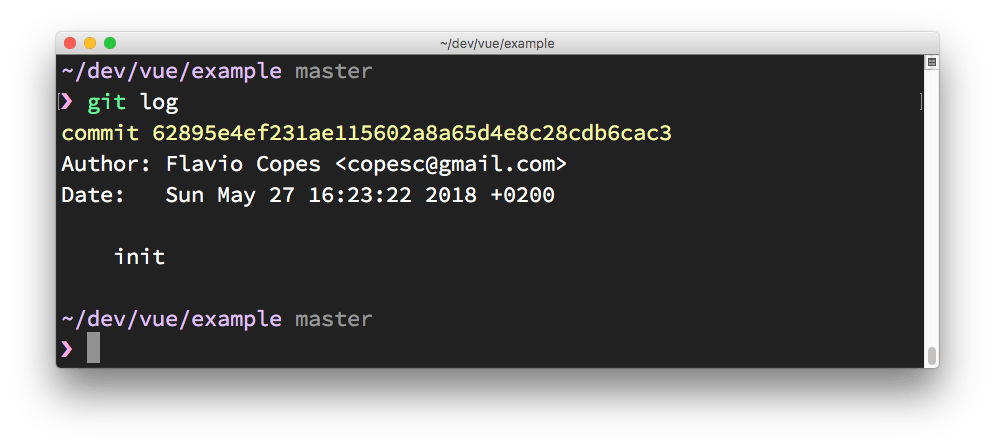

This is pretty cool. How many times you dive in and change things, only to realize when you want to commit the result, that you didn't commit the initial state?

## Use a preset from the command line

You can skip the interactive panel and instruct Vue CLI to use a particular preset:

```bash
vue create -p favourite example-2
```

## Where presets are stored

Presets are stored in the `.vuejs` file in your home directory. Here's mine after creating the first "favorite" preset

```json
{
  "useTaobaoRegistry": false,
  "packageManager": "yarn",
  "presets": {
    "favourite": {
      "useConfigFiles": true,
      "plugins": {
        "@vue/cli-plugin-babel": {},
        "@vue/cli-plugin-eslint": {
          "config": "prettier",
          "lintOn": [
            "save"
          ]
        },
        "@vue/cli-plugin-unit-jest": {}
      },
      "router": true,
      "vuex": true
    }
  }
}
```

## Plugins

As you can see from reading the configuration, a preset is basically a collection of plugins, with some optional configuration.

Once a project is created, you can add more plugins by using `vue add`:

```bash
vue add @vue/cli-plugin-babel
```

All those plugins are used in the latest version available. You can force Vue CLI to use a specific version by passing the version property:

```json
"@vue/cli-plugin-eslint": {
  "version": "^3.0.0"
}
```

this is useful if a new version has a breaking change or a bug, and you need to wait a little bit before using it.

## Remotely store presets

A preset can be stored in GitHub (or on other services) by creating a repository that contains a `preset.json` file, which contains a single preset configuration. Extracted from the above, I made a sample preset in [https://github.com/flaviocopes/vue-cli-preset/blob/master/preset.json](https://github.com/flaviocopes/vue-cli-preset/blob/master/preset.json) which contains this configuration:

```json
{
  "useConfigFiles": true,
  "plugins": {
    "@vue/cli-plugin-babel": {},
    "@vue/cli-plugin-eslint": {
      "config": "prettier",
      "lintOn": [
        "save"
      ]
    },
    "@vue/cli-plugin-unit-jest": {}
  },
  "router": true,
  "vuex": true
}
```

It can be used to bootstrap a new application using:

```bash
vue create --preset flaviocopes/vue-cli-preset example3
```

## Another use of the Vue CLI: rapid prototyping

Until now I've explained how to use the Vue CLI to create a new project from scratch, with all the bells & whistles. But for really quick prototyping, you can create a really simple Vue application, even one that's self-contained in a single .vue file, and serve that, without having to download all the dependencies in the `node_modules` folder.

How? First install the `cli-service-global` global package:

```bash
npm install -g @vue/cli-service-global

//or

yarn global add @vue/cli-service-global
```

Create an app.vue file:

```html
<template>
    <div>
        <h2>Hello world!</h2>
        <marquee>Heyyy</marquee>
    </div>
</template>
```

and then run

    vue serve app.vue

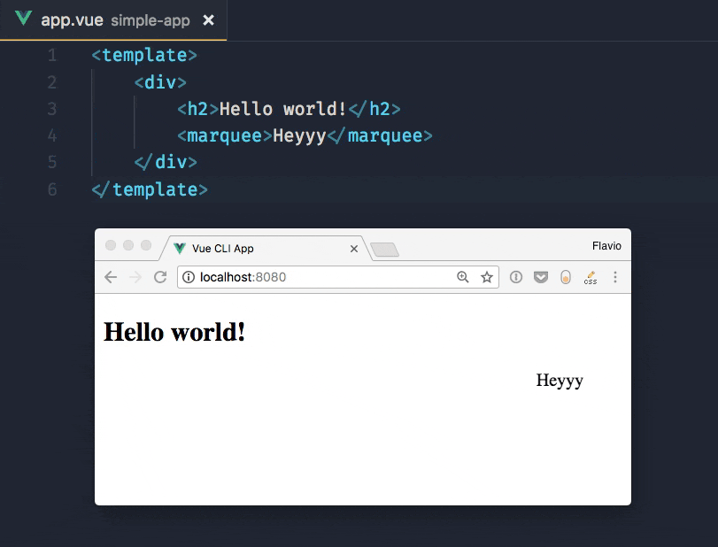

You can serve more organized projects, composed by JavaScript and HTML files as well. Vue CLI by default uses main.js / index.js  as its entry point, and you can have a package.json and any tool configuration set up. `vue serve` will pick it up.

Since this uses global dependencies, it's not an optimal approach for anything more than demonstration or quick testing.

Running `vue build` will prepare the project for deployment in `dist/`, and generate all the corresponding code, also for vendor dependencies.

## Webpack

Internally, Vue CLI uses webpack, but the configuration is abstracted and we don't even see the config file in our folder. You can still have access to it by calling `vue inspect`:

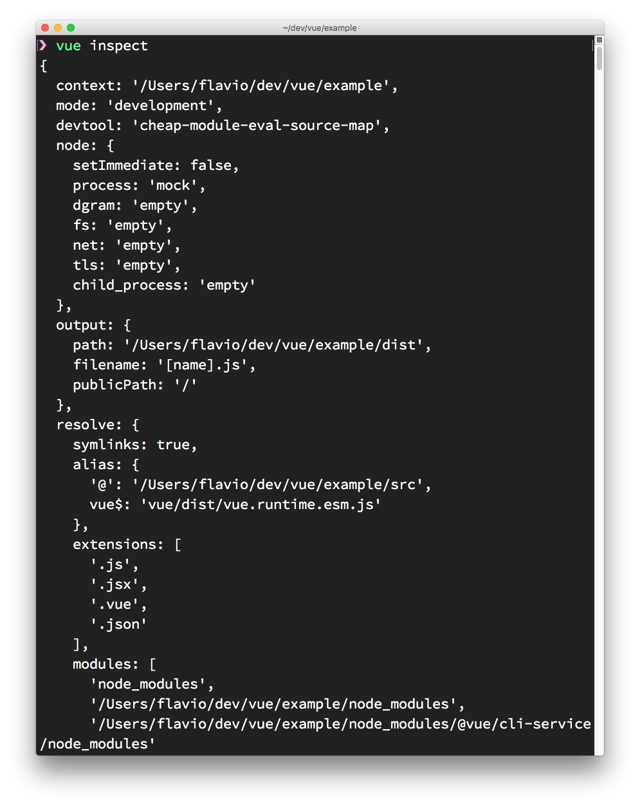
