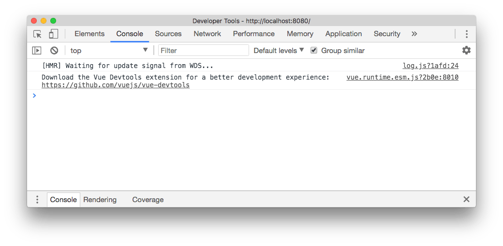
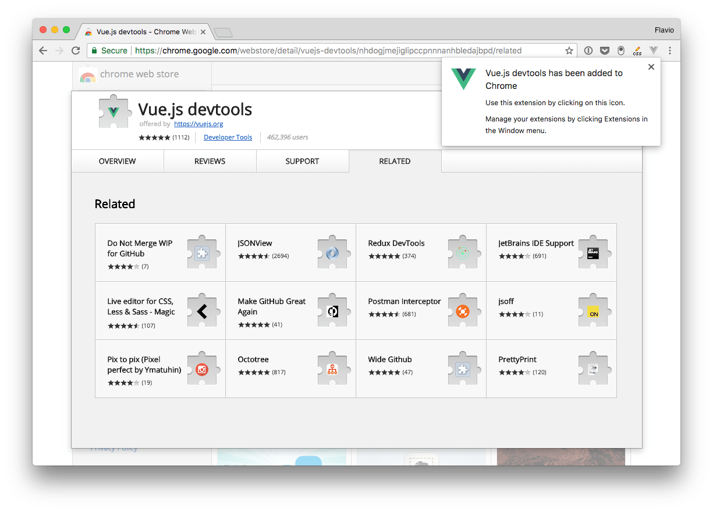
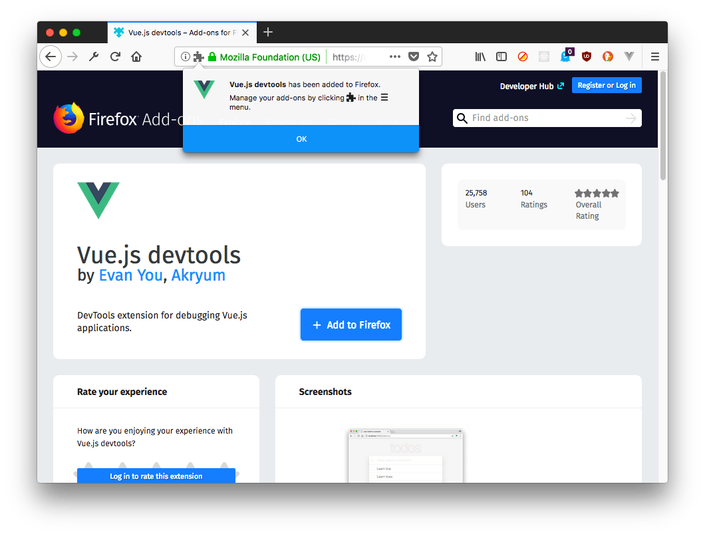
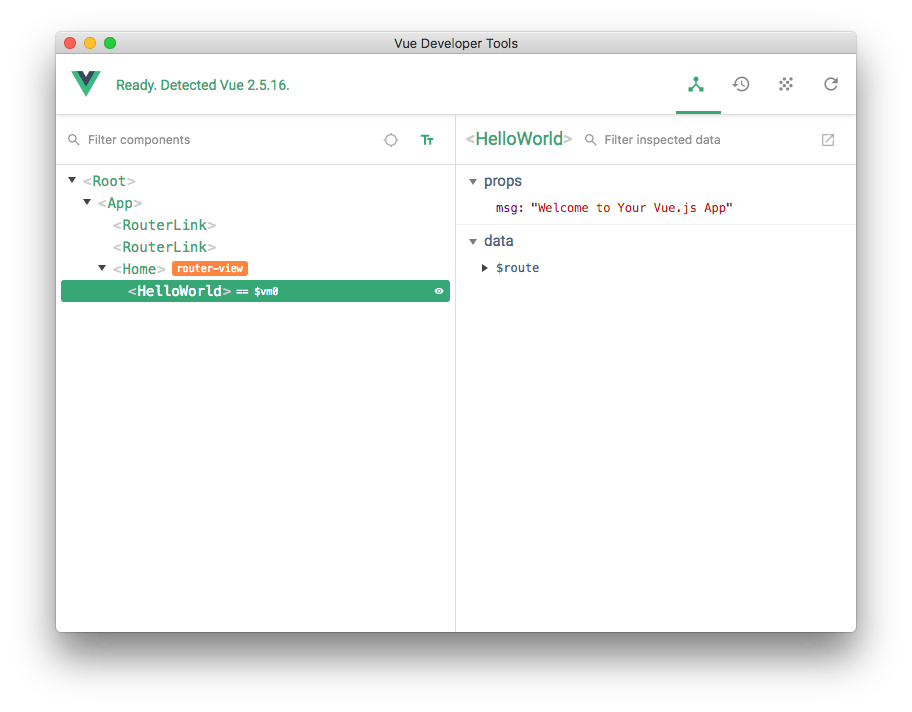
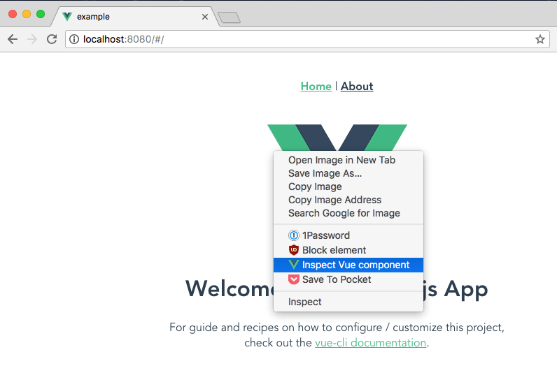
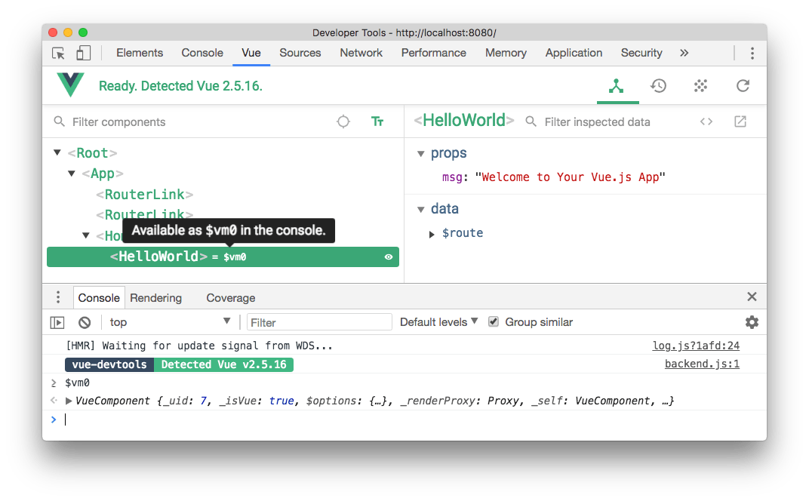
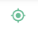

When you're first experimenting with Vue, if you open the Browser Developer Tools you will find this message: "_Download the Vue Devtools extension for a better development experience: [https://github.com/vuejs/vue-devtools](https://github.com/vuejs/vue-devtools)_"



This is a friendly reminder to install the **Vue Devtools Extension**. What's that? Any popular framework has its own devtools extension, which generally adds a new panel to the browser developer tools that is much more specialized than the ones that the browser ships by default. In this case, the panel will let us inspect our Vue application and interact with it.

This tool will be an amazing help when building Vue apps. The developer tools can only inspect a Vue application when it's in development mode. This makes sure no one can use them to interact with your production app (and will make Vue more performant because it does not have to care about the devtools)

Let's install it!

There are 3 ways to install the Vue Dev Tools:

- on Chrome
- on Firefox
- as a standalone application

Safari, Edge and other browsers are not supported with a custom extension, but using the standalone application you can debug a Vue.js app running in any browser.

## Install on Chrome

Go to this page on the Google Chrome Store: [https://chrome.google.com/webstore/detail/vuejs-devtools/nhdogjmejiglipccpnnnanhbledajbpd](https://chrome.google.com/webstore/detail/vuejs-devtools/nhdogjmejiglipccpnnnanhbledajbpd) and click **Add to Chrome**.


Go through the installation process:


The Vue.js devtools icon shows up in the toolbar. If the page does not have a Vue.js instance running, it's grayed out.



If Vue.js is detected, the icon has the Vue logo colors.


The icon does nothing except showing us that there _is_ a Vue.js instance. To use the devtools, we must open the Developer Tools panel, using "View → Developer → Developer Tools", or `Cmd-Alt-i`


## Install on Firefox

You can find the Firefox dev tools extension in the Mozilla addons store: [https://addons.mozilla.org/en-US/firefox/addon/vue-js-devtools/](https://addons.mozilla.org/en-US/firefox/addon/vue-js-devtools/)


Click "**Add to Firefox**" and the extension will be installed. As with Chrome, a grayed icon shows up in the toolbar



And when you visit a site that has a Vue instance running, it will become green, and when we open the Dev Tools we will see a "**Vue**" panel:


## Install the standalone app

Alternatively, you can use the DevTools standalone app.

Simply install it using

```bash
npm install -g @vue/devtools

//or

yarn global add @vue/devtools
```

and run it by calling

```sh
vue-devtools
```

This will open the standalone Electron-based application.


now, paste the script tag it shows you:

```html
<script src="http://localhost:8098"></script>
```

inside the project `index.html` file, and wait for the app to be reloaded, and it will automatically connect to the app:



## How to use the Developer Tools

As mentioned, the Vue DevTools can be activated by opening the Developer Tools in the browser and moving to the Vue panel.

Another option is to right-click on any element in the page, and choose "Inspect Vue component":



When the Vue DevTools panel is open, we can navigate the components tree. When we choose a component from the list on the left, the right panel shows the props and data it holds:


On the top there are 4 buttons:

- **Components** (the current panel), which lists all the component instances running in the current page. Vue can have multiple instances running at the same time, for example, it might manage your shopping cart widget and the slideshow, with separate, lightweight apps.
- **Vuex** is where you can inspect the state managed through Vuex.
- **Events** shows all the events emitted
- **Refresh** reloads the devtools panel

Notice the small `= $vm0` text beside a component? It's a handy way to inspect a component using the Console. Pressing the "esc" key shows up the console in the bottom of the devtools, and you can type `$vm0` to access the Vue component:



This is very cool to inspect and interact with components without having to assign them to a global variable in the code.

### Filter components

Start typing a component name, and the components tree will filter out the ones that don't match.


### Select component in the page

Click the



button and you can hover any component in the page with the mouse, click it, and it will be opened in the devtools.

### Format components names

You can choose to show components in camelCase or use dashes.

### Filter inspected data

On the right panel, you can type any word to filter the properties that don't match it.

### Inspect DOM

Click the Inspect DOM button to be brought to the DevTools Elements inspector, with the DOM element generated by the component:


### Open in editor

Any user component (not framework-level components) has a button that opens it in your default editor. Very handy.
